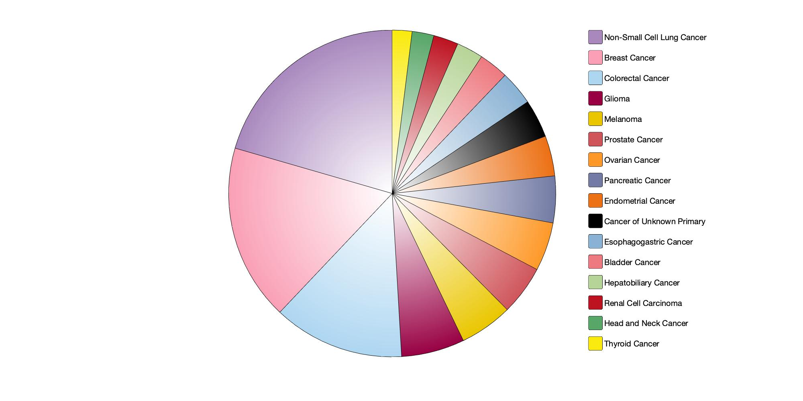

# superpie
A superior pie chart in MATLAB

<div align=center></div>

```matlab
% 1-click running superpie

% Input test data:
T = readtable('input_superpie.txt');

% Usage: hp = superpie(percentage, color, text);
hp = superpie(T.Percentage_of_samples, table2array(T(:,[3,4,5])), T.Category);
```
